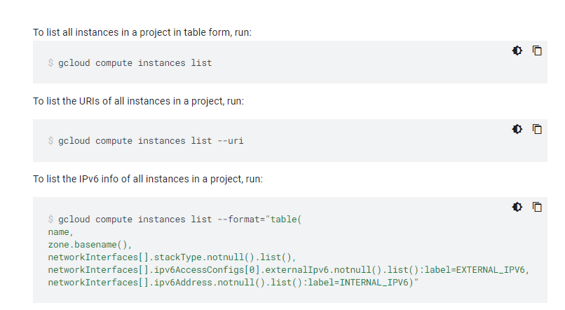
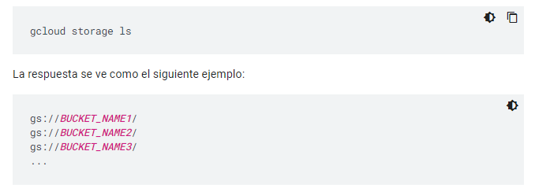
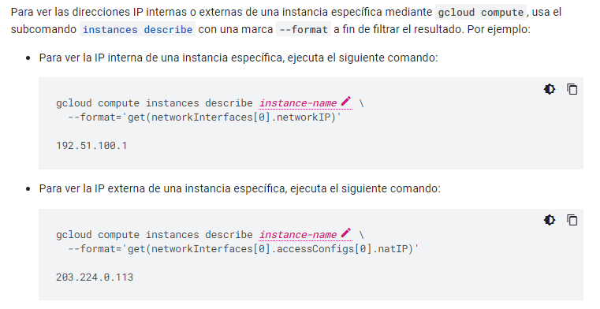
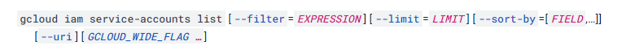

# **Actividad 03**

- Listar Compute Engine
```
gcloud compute instances list
```
[Compute Engine](https://cloud.google.com/sdk/gcloud/reference/compute/instances/list)

<span style="color: #CC00CC;">
    Ejemplo
</span>



- Listar buckets disponibles
```
gcloud storage ls
```
[Enumerar buckets](https://cloud.google.com/storage/docs/listing-buckets?hl=es-419#cli-list-buckets)

<span style="color: #CC00CC;">
    Ejemplo
</span>



- Listar Listar IPs en uso, existentes o reservadas
```
gcloud compute instances list
```
[Ddirecciones IP de una instancia](https://cloud.google.com/compute/docs/instances/view-ip-address?hl=es-419)

<span style="color: #CC00CC;">
    Ejemplo
</span>



- Listar Service Accounts existentes en un proyecto
```
gcloud iam service-accounts list
```
[Service Accounts list](https://cloud.google.com/sdk/gcloud/reference/iam/service-accounts/list)

<span style="color: #CC00CC;">
    Sintaxis
</span>

